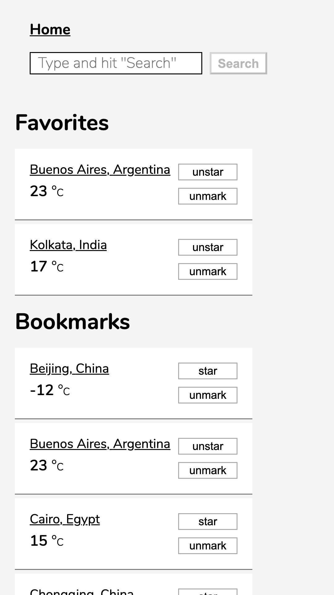
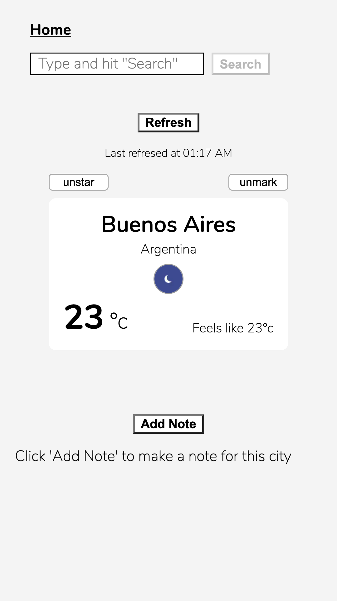
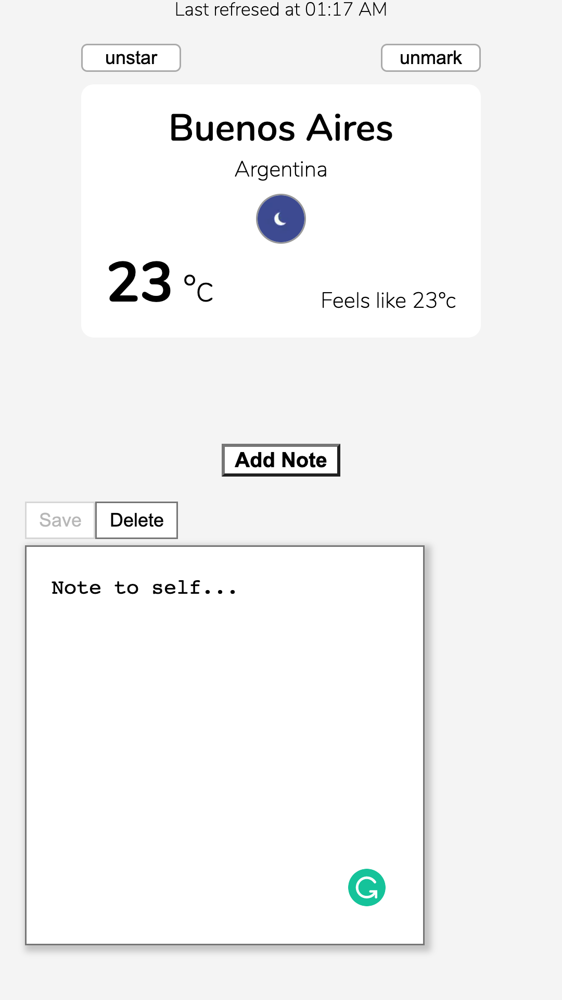

# Weather App

## Installation

Bootstrapped with Create React App:

- clone repository

- `yarn install`

- `yarn start`

## ScreenShots

Home Screen with Favorites and Bookmarks

City Detail Screen

City Detail Screen With Note

## Todo

Display all notes even for removed cities or
delete notes when cities are deleted from all lists
